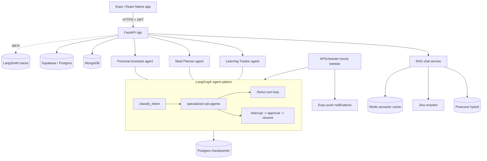

# AI Engineer — Multi-Agent Assistant Platform

Production-style backend for three LLM agents (Learning Tracker, Meal Planner, Personal Assistant) plus a hybrid RAG chat service — built on FastAPI + LangGraph, with human-in-the-loop approvals, ReAct tool use, streaming, proactive scheduling, and an evaluation/fine-tuning pipeline.

> **Live:** API → https://aiengineer.duckdns.org · Mobile/Web (Expo) → https://genai-app.netlify.app
> Backend deployed on **AWS EC2** (systemd + Caddy auto-HTTPS) with **GitHub Actions CI/CD**; Expo (React Native) frontend live on web and mobile.

`63 tests passing` · `~7k LOC` · Python 3.13

---

## Why this project

It's not a single chatbot — it's a small platform that exercises the patterns an AI Engineer is actually hired to build and operate:

- **Multi-agent orchestration** with a router → specialized sub-agents per domain (LangGraph state machines).
- **Human-in-the-loop** — sensitive actions pause via `interrupt()` and resume on approval, durable across restarts (Postgres checkpointer).
- **Agentic tool use** — research nodes run a ReAct loop (the model decides what to search, reads results, searches again) rather than one fixed call.
- **Streaming** — token streaming (RAG, tutor) and node-progress streaming (structured agents) over SSE.
- **Proactive agents** — per-user scheduled digests/plans with timezone-aware delivery and push notifications.
- **Evaluation & cost engineering** — every LLM call is captured to fine-tune a local model (Llama 3.1 8B) as a gpt-4o-mini replacement, *measured* before shipping.
- **Observability** — opt-in LangSmith tracing across every agent.

---

## Architecture



**Stores:** MongoDB (users, roadmaps, digests, triggers, approvals) · Supabase/Postgres (chats, meal plans, todos, memory) · Postgres (LangGraph checkpointer) · Pinecone (vectors) · Redis (semantic cache).

---

## The three agents

Each agent is a LangGraph graph: `load_memory → classify_intent → {specialized sub-agents} → END`.

| Agent | Sub-agents | Notable patterns |
|---|---|---|
| **Learning Tracker** | roadmap, tutor, research, progress | HITL roadmap approval · token streaming (tutor) · ReAct resource search · daily digest |
| **Meal Planner** | log, query, research, plan | HITL plan approval · ReAct nutrition lookup (Edamam) · weekly plan generation |
| **Personal Assistant** | todo, research, notes, agenda, breakdown | HITL task deletion · ReAct web search · daily agenda digest |

Cross-cutting capabilities are shared modules, not per-agent copies:
`trigger_store` (scheduling) · `approval_store` (HITL) · `react.run_tool_loop` (tool loops).

---

## RAG chat service

Hybrid retrieval (Pinecone dense+sparse) → Jina rerank → grounded generation, with a Redis **semantic cache** (cosine ≥ 0.95) and token streaming. Anti-hallucination prompting ("answer only from context").

---

## Evaluation & fine-tuning

A capture-and-measure pipeline to cut inference cost by distilling gpt-4o-mini into a local Llama 3.1 8B:

1. **Capture** — a callback on the shared LLM records every call (plain / structured / tool-calling) to JSONL, no agent code changes (`LLM_CAPTURE=1`).
2. **Eval** — `app/evals/harness.py` scores teacher vs student on the same records.

| Node (per-agent task) | Teacher (gpt-4o-mini) | Student (Llama 3.1 8B) |
|---|---|---|
| PA classify_intent | `<!-- TODO -->` | `<!-- TODO -->` |
| Learning classify_intent | `<!-- TODO -->` | `<!-- TODO -->` |
| Meal log_extract | `<!-- TODO -->` | `<!-- TODO -->` |
| PA task_add (tool call) | `<!-- TODO -->` | `<!-- TODO -->` |

> Fill from `pytest tests/test_evals.py` + the harness over `finetune/*.jsonl`. See [app/evals/README.md](app/evals/README.md).

---

## Observability

LangSmith tracing is opt-in and logged at startup:

```bash
LANGSMITH_TRACING=true
LANGSMITH_API_KEY=ls__...
LANGSMITH_PROJECT=aiengineer-agents   # optional; defaulted
```

Wiring: [app/core/observability.py](app/core/observability.py), called from the FastAPI lifespan.

---

## Deployment & CI/CD

Deployed as a **single always-on instance** (not serverless) because the app runs an APScheduler cron loop and in-process background workers that must survive between requests — a constraint serverless would silently break.

- **Host:** AWS EC2, run under **systemd** as a `gunicorn` + `uvicorn` worker (single worker: the scheduler and in-memory job state assume one process).
- **TLS/reverse proxy:** **Caddy** terminates HTTPS with automatic Let's Encrypt certificates.
- **CI/CD:** **GitHub Actions** SSHes to EC2 on every push to `main` — pulls code, installs changed deps, restarts the service, and verifies it came back healthy. See [.github/workflows/deploy.yml](.github/workflows/deploy.yml).
- **Managed services:** Pinecone, Supabase/Postgres, Redis, and MongoDB run as external managed backends, so the instance stays lightweight.

---

## Tech stack

FastAPI · LangGraph / LangChain · OpenAI (gpt-4o-mini) · Llama 3 via Ollama · Pinecone · Jina rerank · MongoDB (motor) · Supabase/Postgres · Redis · APScheduler · LangSmith · AWS EC2 · GitHub Actions · Caddy · Expo push · pytest · pip-tools.

---

## Local setup

```bash
python -m venv .venv && source .venv/bin/activate
pip install -r requirements.txt -r requirements-dev.txt
# create .env with: OPENAI_API_KEY, PINECONE_KEY, SUPABASE_URL, SUPABASE_KEY,
# DATABASE_URL, MONGODB_URI, REDIS_URL, TAVILY_API_KEY, JINA_API_KEY,
# EDAMAM_APP_ID/KEY  (LANGSMITH_* optional — see Observability)
uvicorn app.main:app --reload
```

Dependencies are managed with **pip-tools** — edit `requirements.in` and run `pip-compile`, never `pip freeze`.

## Testing

```bash
pytest -q          # 63 tests, fully offline (all external clients mocked)
```
